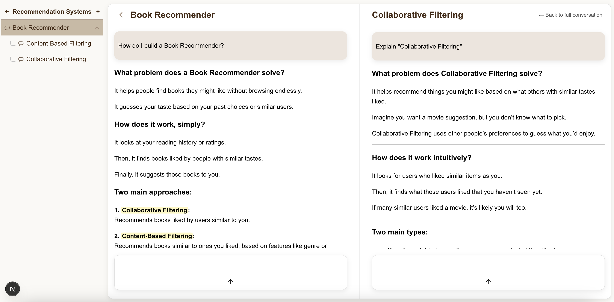

# Tutoring AI Chatbot

An interactive study workspace that pairs a PDF reader with a chat assistant. Highlight text as you read, jump between annotations, and keep context-aware conversations grounded in the document.

Demo video: https://www.youtube.com/watch?v=jSPLiHsQnW8

## Screenshots

## Features

- Side-by-side PDF reader and chat panel
- Text highlights and annotation-linked threads
- Region capture for image snippets
- Quick selection actions (add to chat, highlight, set title)

## Getting Started

### Frontend
1. `cd frontend/my-app`
2. `npm install`
3. `npm run dev`

### Backend
1. `cd backend`
2. `python3 -m venv venv`
3. `source venv/bin/activate`
4. `pip install -r requirements.txt`
5. `export OPENAI_API_KEY=""`
6. `python -m uvicorn main:app --reload`

